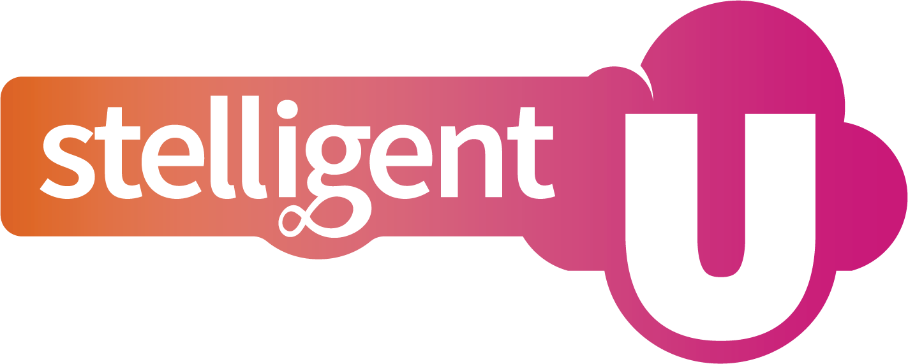

# Welcome to Stelligent U

Welcome to the technical side of Stelligent University,
[Stelligent's](https://stelligent.com) onboarding program for engineers. This
repo includes a series of learning modules designed to give cloud engineers
practical experience working with AWS and related technologies.

The goal of this material is to prepare all of our engineers for their first
engagements as Stelligent consultants. Any topic or principal presented here
is part of our technical knowledge baseline: this is what we consider a
"Minimum Viable Engineer". There are a _lot_ of other ideas and technologies
that you'll come across and need to know in your work.  We can't fit it all in,
though, and these are the essentials.

For further information, please see:

* [MVE.md](MVE.md): what we mean by "Minimum Viable Engineer"
* [WORKFLOW.md](WORKFLOW.md): how we suggest you use Stelligent U

## Audience

This is a series of lessons originally written for new Associate Engineers at
Stelligent. The goal of this material is to prepare all of our engineers for
their first engagements as Stelligent engineers. Any topic or principal
presented here is part of our technical knowledge baseline: this is what we
consider a _Minimum Viable Engineer_. There are a _lot_ of other ideas and
technologies that you'll come across and need to know in your career.
We can't fit it all in, though, and these are the essentials.

## Materials

The core of Stelligent U is modules 1-12, the series that makes up our baseline
definition of a Minimum Viable Engineer. Other modules are also available that
provide hands-on experience with tech beyond the baseline. We want to add more
and more to those "continuous learning" modules as time goes by.

You'll find a handful of ways we present each topic. Most of the technical
exercises are labs, where we want you to gain a surface level of exposure to
a variety of AWS services and their most common or compelling features.

Labs within a lesson build on each other. Many lessons require the experience
of previous lessons. Unless you're completely blocked, work through them in
order.

When we provide materials for a lab -- e.g. CloudFormation templates or
policy files -- start with those and add to them as requested.

Some topics also include retrospectives. These aren't always focused so much
on a technical exercise. Our goal here is usually to get you to think more
broadly about the technology at hand.

We also provide further reading for each topic. Find time to explore some of
these materials more deeply. Pursue your curiosity. There are many excellent
resources out there, and we particularly want you to learn more where the topics
match up with your interests.
