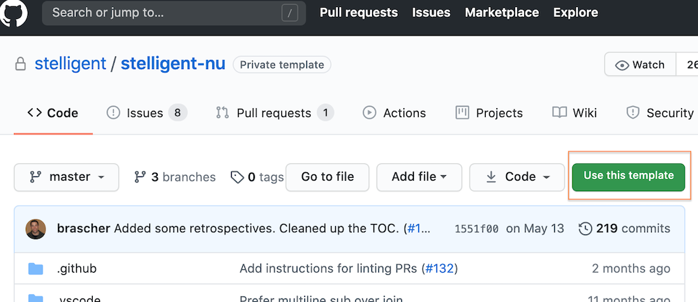
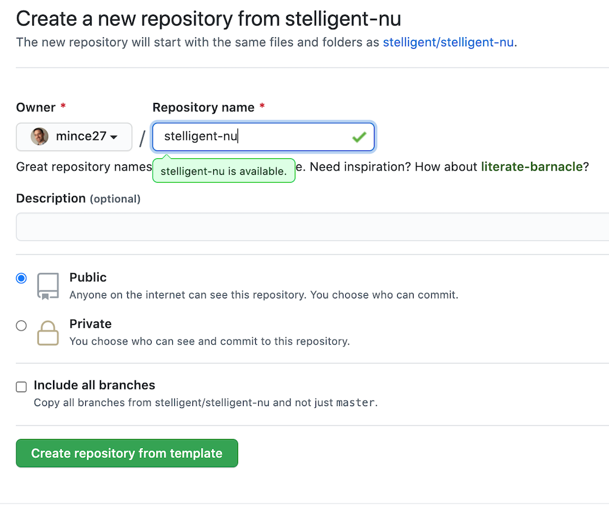
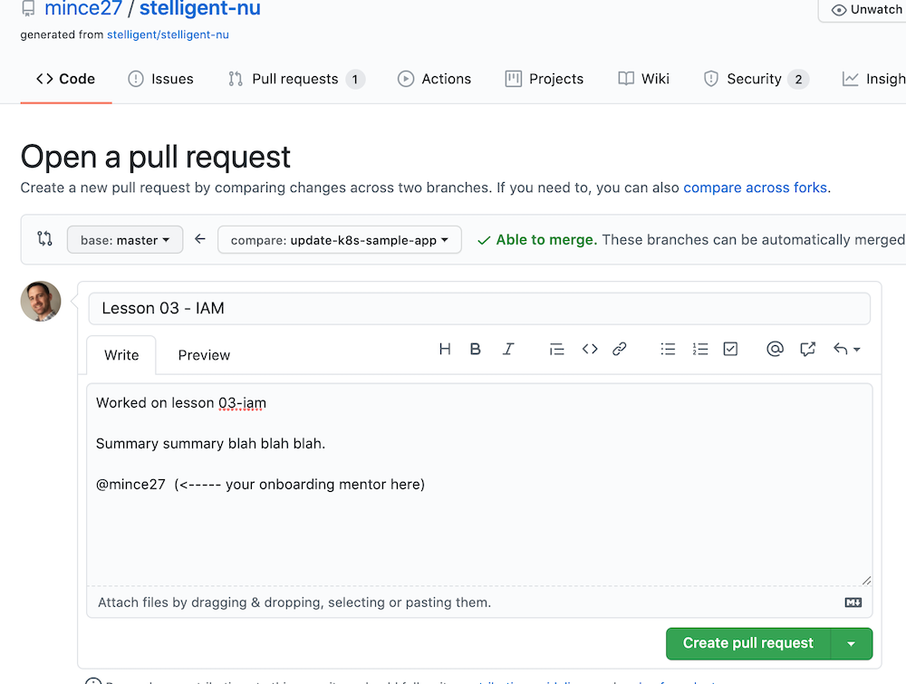

# Working with Stelligent U

Our program isn't a step by step "how-to". The modules generally don't say much
on how to accomplish specific tasks; instead they walk you through goals in a
sensible order, provide insight on unique challenges, and give pointers to the
solutions. They aim to teach you how to learn AWS, constantly encouraging you to
use Amazon's docs directly. Learning from the source of truth is always the
best, and with AWS docs, it is certainly a skill unto itself.  As the poet
Basho once said, "Do not seek to follow in the footsteps of the wise. Seek what
they sought."

At Stelligent, we set aside four weeks for new engineers to onboard and go
through the core modules. While we pair new engineers up with a mentor who has
gone through the course and is more knowledgeable and experienced with AWS, the
majority of the material is completed by individuals. This course was designed
to be complementary to other studies and coursework and to fill a niche we felt
was not available elsewhere.

Digging deeper is strongly encouraged. If you want to explore StackSets in the
Cloudformation module, cross account role assumptions in the IAM module, or use
an API Gateway in conjunction with the Lambda module, please do explore that
frontier. We built Stelligent U to focus on learning how to learn, and deeper,
unguided exploration is one of the best ways to do so.

## Getting Started: Duplicate this Repo

1. Click the "Use this template" button near the top of our repo page to create
   your repository:

    

1. For _Owner_ on the page that comes up, be sure to choose your repo space
   rather than Stelligent's.

    

## Working on Lessons

Each subdirectory is its own topic. They're numbered so that you can progress
through them in a logical order. Later lessons will build on previous ones.

Within each topic's README, you will find a series of lessons and labs.
As you go through them, save any code you write: scripts, templates, policy
documents, etc. Add them to your copy of this repo. Answer questions inline
using the Markdown quote prefix ("> ") to identify your own additions to the
README files.

## General Tips

- Use a Markdown previewer and linter so formatting your answers is easier.
  - Atom:
    - [Lint](https://atom.io/packages/linter-markdown)
    - [Preview](https://atom.io/packages/markdown-it-preview)
  - Sublime Text:
    - [Lint](https://packagecontrol.io/packages/SublimeLinter-contrib-markdownlint)
    - [Preview](https://packagecontrol.io/packages/MarkdownPreview)
  - VSCode:
    - [Lint](https://marketplace.visualstudio.com/items?itemName=DavidAnson.vscode-markdownlint)
    - Markdown Preview is built in
  - macOS:
    - Brett Terpstra's excellent [Marked 2](https://marked2app.com/) provides both

- [cfn-lint](https://github.com/aws-cloudformation/cfn-python-lint) is very
  handy for lessons that involve CloudFormation.
  - [Atom](https://atom.io/packages/atom-cfn-lint)
  - [Sublime Text](https://packagecontrol.io/packages/SublimeLinter-contrib-cloudformation)
  - [VSCode](https://marketplace.visualstudio.com/items?itemName=kddejong.vscode-cfn-lint)

- When creating AWS resources for these lessons be mindful of how they are
  named. If you're working within an AWS account that's shared with others,
  include your name or some other unique identifier to avoid colliding with
  others who may be working on the same module.

- Stelligent's sandbox account is "cleaned" every weekend and most resources
  are automatically deleted. If you have a solution like
  [aws-nuke](https://github.com/rebuy-de/aws-nuke),
  [cloud-custodian](https://cloudcustodian.io/), or
  [DivvyCloud](https://divvycloud.com/) running in your account,
  it can be great for infrastructure-as-code and pipeline deployment discipline,
  but it can also be really frustrating if you're not ready for that. Just be
  sure you're aware of the automation running and account for it in your
  deployment workflow. Most importantly, keep everything in code and be sure
  to push it from your dev computer to your upstream repo often!

## Finishing a Lesson

When you're ready to review a lesson with your mentor, create a branch, push
your changes to it, and create a pull request to the `master` branch of the
repository you created from the template.

(NOTE: please _do not_ open a PR back to the `stelligent/stelligent-u` repo.)

